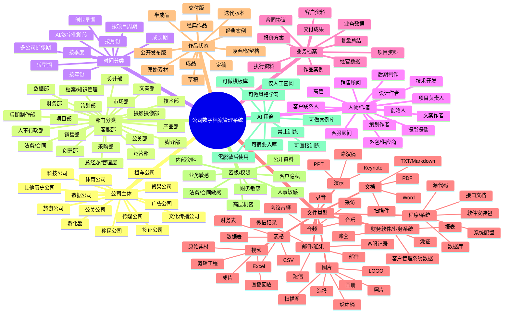

# 黑卫士 AI 数字档案管理系统 - 第一版框架

版本：V1 草案  
用途：用于确认公司 26 年历史沉淀数据的分类框架、档案字段、价值分级和后续 AI 检索/训练方向。

## 一、总体思路

这套档案系统不建议只按“文件夹”管理，而要建立一套多维标签体系。一个文件可以同时属于：

- 某一家公司
- 某一个部门
- 某一个时间段
- 某一个项目/客户/案例
- 某一位作者/负责人/参与人
- 某一种文件格式
- 某一个业务阶段
- 某一个价值等级
- 某一个 AI 用途

这样未来做检索系统时，可以支持类似这些问题：

- 找 2012 年到 2016 年广告公司做过的汽车客户经典案例
- 找某位设计师参与过的所有画册、视频、PPT 成品
- 找移民公司历年客户合同、签证材料和成功案例
- 找所有能喂给 AI 的经典文案、方案、视觉、报价、合同模板
- 找某个项目的原始素材、半成品、定稿、交付文件和复盘资料

## 二、思维导图

## 三、公司主体分类清单

| 一级分类 | 二级分类 | 典型档案 | 备注 |
|---|---|---|---|
| 移民公司 | 客户咨询、方案、申请材料、成功案例 | 客户资料、申请表、顾问方案、递交材料、获批记录、合同、收款记录 | 高隐私，必须脱敏和权限控制 |
| 签证公司 | 签证办理、国家分类、客户材料 | 护照扫描、签证表格、邀请函、行程单、拒签/获签记录 | 高隐私，建议单独密级 |
| 旅游公司 | 线路、供应商、客户团、导游执行 | 行程方案、报价单、团档、酒店/机票、照片视频、客户反馈 | 可沉淀成产品线路库 |
| 体育公司 | 赛事、活动、培训、赞助 | 活动方案、招商方案、赛事照片、视频、报名表、成绩表 | 可形成活动案例库 |
| 广告公司 | 品牌、策划、设计、投放、制作 | 提案、文案、设计稿、PPT、画册、视频、投放数据、客户反馈 | 重点沉淀创意风格和案例 |
| 租车公司 | 车辆、客户、订单、司机、合同 | 车辆档案、租赁合同、客户订单、保险、维修、事故记录 | 涉及运营和法务 |
| 文化传播公司 | 活动、内容、媒体、演出、传播 | 活动方案、新闻稿、媒体名单、传播数据、照片视频 | 可形成公关传播案例 |
| 孵化器 | 入驻企业、政策、活动、投融资 | 企业资料、入驻合同、活动资料、政策文件、项目路演 | 可形成企业服务知识库 |
| 贸易公司 | 供应链、采购、销售、物流 | 采购合同、销售合同、报关资料、物流单、供应商档案 | 涉及合同和财务 |
| 科技公司 | 产品、研发、系统、代码、运维 | 产品文档、源代码、数据库、接口、部署文档、测试记录 | 需区分源码密级 |
| 数据公司 | 数据资产、数据处理、分析报告 | 原始数据、清洗数据、分析模型、报表、数据字典 | 需要严格数据权限 |
| 传媒公司 | 内容、账号、视频、栏目、发布 | 选题、脚本、素材、成片、发布记录、账号数据 | 可训练内容风格 |
| 公关公司 | 客户、舆情、媒体、活动、危机 | 公关方案、新闻稿、媒体资源、舆情报告、危机预案 | 敏感度高，需分级 |
| 其他历史公司 | 待补充 | 工商文件、项目文件、合同、财务、人事 | 后续按实际公司补齐 |

## 四、部门分类清单

| 部门 | 主要档案 | 典型文件类型 | AI 价值 |
|---|---|---|---|
| 总经办/管理层 | 战略、会议纪要、制度、重大决策 | Word、PDF、PPT、录音、邮件 | 公司历史、决策逻辑、战略风格 |
| 市场部 | 市场调研、竞品分析、推广计划 | PPT、Word、Excel、图片、网页截图 | 市场判断、行业知识 |
| 销售部 | 客户线索、报价、成交记录、话术 | Excel、CRM 数据、合同、录音 | 销售模型、话术库 |
| 客服部 | 客户沟通、售后记录、投诉处理 | 录音、聊天记录、工单、邮件 | 客户问题库、服务标准 |
| 项目部 | 项目计划、执行表、交付、复盘 | 甘特表、Excel、PPT、PDF | 项目管理经验 |
| 策划部 | 提案、策划案、活动方案、传播方案 | PPT、Word、PDF | 重点训练策划能力 |
| 创意部 | 创意概念、主题、口号、命名 | Word、PPT、图片 | 重点训练创意思维 |
| 设计部 | 海报、画册、VI、包装、版式 | PSD、AI、PDF、JPG、PNG | 视觉风格库 |
| 文案部 | 标题、软文、新闻稿、脚本、广告语 | Word、Markdown、TXT、PPT | 文案风格库 |
| 摄影摄像部 | 原始照片、原始视频、拍摄脚本 | RAW、JPG、MP4、MOV | 素材库和案例库 |
| 后期制作部 | 剪辑工程、特效、调色、成片 | PR、AE、达芬奇工程、MP4 | 成片风格和工艺沉淀 |
| 媒介部 | 媒体资源、投放、发布记录 | Excel、PDF、截图、报告 | 媒体资源和效果分析 |
| 公关部 | 公关稿、危机处理、舆情报告 | Word、PDF、邮件、截图 | 公关话术和舆情经验 |
| 技术部 | 源码、系统文档、接口、部署 | 代码、数据库、API 文档 | 内部系统资产 |
| 数据部 | 数据集、报表、分析模型 | CSV、Excel、数据库、BI 报告 | 数据智能化基础 |
| 产品部 | 需求、原型、版本记录、用户反馈 | PRD、原型图、PPT、表格 | 产品方法沉淀 |
| 运营部 | 账号运营、内容计划、活动数据 | Excel、截图、文档、视频 | 运营方法库 |
| 人事行政部 | 员工档案、制度、招聘、考勤 | Word、PDF、Excel、扫描件 | 高隐私，通常不训练 |
| 财务部 | 凭证、账套、报表、发票、收支 | 财务软件数据、Excel、PDF | 高敏感，仅统计和审计 |
| 法务/合同 | 合同、协议、授权、纠纷 | Word、PDF、扫描件 | 模板库，需权限控制 |
| 采购部 | 供应商、采购合同、报价比价 | Excel、PDF、合同、邮件 | 供应商和成本库 |
| 档案/知识管理 | 分类规则、目录、索引、备份记录 | Markdown、Excel、数据库 | 系统自身管理 |

## 五、时间段分类

| 时间维度 | 分类方式 | 作用 |
|---|---|---|
| 年份 | 1999、2000、2001……按实际成立年份起算 | 最基础的历史检索 |
| 阶段 | 创业早期、成长期、扩张期、转型期、数字化/AI 阶段 | 便于讲公司发展脉络 |
| 季度/月度 | 2023-Q1、2023-05 | 用于财务、经营、运营数据 |
| 项目周期 | 立项、策划、执行、交付、复盘、维护 | 用于还原项目全过程 |
| 版本周期 | V1、V2、V3、定稿、最终交付版 | 用于作品迭代管理 |

## 六、文件格式分类

| 大类 | 常见格式 | 重点处理方式 |
|---|---|---|
| 文档 | doc、docx、pdf、txt、md、rtf | OCR、提取正文、生成摘要、打标签 |
| 表格 | xls、xlsx、csv、numbers | 识别字段、抽取表头、建立数据库 |
| 演示 | ppt、pptx、key | 提取标题、页面缩略图、备注和图片 |
| 图片 | jpg、jpeg、png、gif、tiff、bmp、raw、psd、ai | 识别内容、人物、场景、文字、设计风格 |
| 音频 | mp3、wav、m4a、aac | 转文字、识别说话人、摘要 |
| 视频 | mp4、mov、avi、mkv、wmv | 抽帧、转字幕、识别场景、生成摘要 |
| 邮件/通讯 | eml、msg、mbox、聊天导出 | 按联系人、项目、时间、主题归档 |
| 程序 | js、py、java、php、html、css、sql、zip | 建立代码仓库、识别项目和版本 |
| 数据库 | db、sqlite、sql、bak、dump | 建表、字段说明、权限隔离 |
| 财务软件 | 账套、凭证、报表导出 | 单独封存，建立只读索引 |
| 压缩包 | zip、rar、7z、tar | 先登记，再解压扫描，保留原包 |
| 扫描件 | pdf、jpg、tiff | OCR、识别证件/合同/发票类型 |

## 七、业务资料分类

| 分类 | 子类 | 例子 |
|---|---|---|
| 客户档案 | 客户基本信息、联系人、沟通记录、成交记录 | 客户表、名片、微信记录、会议纪要 |
| 项目档案 | 立项、需求、方案、报价、执行、交付、复盘 | 项目计划、PPT、报价单、验收单 |
| 作品档案 | 文案、设计、视频、画册、活动、系统 | 海报、成片、画册、网站、活动现场图 |
| 案例档案 | 成功案例、失败案例、标杆案例、经典案例 | 案例说明、结果数据、复盘报告 |
| 合同档案 | 客户合同、供应商合同、授权协议、租赁合同 | 合同扫描件、电子合同、补充协议 |
| 财务档案 | 账套、凭证、发票、收付款、报表 | 财务软件、Excel、PDF、银行回单 |
| 人事档案 | 员工资料、合同、考勤、薪酬、绩效 | 身份证、劳动合同、简历、绩效表 |
| 采购档案 | 供应商、报价、采购单、入库单 | 报价单、采购合同、发票 |
| 行政档案 | 证照、工商、固定资产、办公制度 | 营业执照、印章记录、资产表 |
| 数据资产 | 业务数据、用户数据、运营数据、历史统计 | 数据库、表格、BI 报告 |
| 品牌资产 | LOGO、VI、口号、品牌手册、模板 | 源文件、规范 PDF、应用图 |
| 媒体资产 | 新闻稿、媒体名单、发布截图、传播报告 | Word、Excel、截图、网页归档 |

## 八、作品状态和价值分级

| 等级/状态 | 定义 | 处理建议 |
|---|---|---|
| 原始素材 | 未整理的照片、视频、录音、扫描件、客户原始资料 | 保留原件，建立索引，不轻易改名破坏证据链 |
| 草稿 | 初步想法、未完成方案、临时文档 | 可入库，但标记为草稿 |
| 半成品 | 已有结构但未最终交付 | 记录版本和负责人 |
| 迭代版本 | V1、V2、V3 等多轮修改 | 保留关键版本，识别最终版 |
| 定稿 | 内部确认版本 | 高优先级入库 |
| 成品 | 已完成作品 | 建立作品档案 |
| 交付版 | 已交给客户/外部使用 | 重点保留 |
| 公开发布版 | 网站、媒体、公众号、视频平台已发布 | 可做公开案例素材 |
| 经典作品 | 代表公司能力、风格、审美、方法的作品 | 优先进入 AI 风格学习库 |
| 经典案例 | 有完整背景、过程、结果和复盘的项目 | 优先进入案例库 |
| 失败案例 | 结果不佳但有经验教训 | 可做内部学习，不宜公开 |
| 废弃资料 | 无继续使用价值但需历史留存 | 低频冷存储 |
| 重复/垃圾 | 重复文件、缓存、临时文件 | 去重后再删除或归档 |

## 九、密级和权限分级

| 密级 | 内容范围 | AI 使用建议 |
|---|---|---|
| L0 公开 | 已公开发布的文章、视频、海报、新闻稿 | 可训练、可展示 |
| L1 内部 | 内部制度、普通方案、非敏感项目资料 | 可摘要，可内部检索 |
| L2 业务敏感 | 客户报价、商务谈判、项目执行细节 | 脱敏后可训练 |
| L3 隐私敏感 | 客户证件、签证材料、员工档案、通讯记录 | 不直接训练，仅权限检索 |
| L4 财务敏感 | 账套、凭证、银行流水、薪酬、税务 | 禁止训练，受控检索 |
| L5 核心机密 | 股权、重大合同、源代码、核心数据、战略决策 | 仅授权人员查阅 |

## 十、AI 知识库用途分类

| AI 用途 | 适合资料 | 说明 |
|---|---|---|
| 公司历史知识库 | 公司介绍、重大节点、组织变化、老项目 | 让 AI 理解公司 26 年历史 |
| 案例库 | 经典项目、成功案例、失败复盘 | 让 AI 学会“公司怎么做事” |
| 作品风格库 | 文案、PPT、画册、视频、设计稿 | 让 AI 学会“公司自己的风格” |
| 模板库 | 合同模板、报价模板、方案模板、邮件模板 | 提高日常工作效率 |
| 客户知识库 | 客户行业、项目历史、偏好、反馈 | 需权限和脱敏 |
| 销售话术库 | 咨询记录、成交话术、报价解释 | 训练销售智能体 |
| 项目管理库 | 项目计划、执行表、复盘、风险清单 | 训练项目经理智能体 |
| 财务经营分析库 | 财务报表、经营数据、成本数据 | 只做受控分析，不喂通用模型 |
| 法务合同库 | 合同模板、协议条款、风险案例 | 用于合同审查辅助 |
| 人事管理库 | 岗位说明、招聘、制度、培训 | 不使用个人隐私资料训练 |
| 技术知识库 | 代码、接口、数据库、部署文档 | 训练内部技术助手 |

## 十一、建议的档案字段

以后每个文件或每个档案条目，建议至少有这些字段：

| 字段 | 示例 | 说明 |
|---|---|---|
| 档案编号 | HWS-ADV-2014-000123 | 唯一编号 |
| 文件原名 | 某客户品牌提案终稿.pptx | 保留原始文件名 |
| 标准名称 | 2014-广告公司-某客户-品牌提案-定稿.pptx | 系统整理后的名称 |
| 公司主体 | 广告公司 | 对应哪家公司 |
| 部门 | 策划部 | 主要归属部门 |
| 项目/客户 | 某客户品牌项目 | 支持项目检索 |
| 时间 | 2014-06 | 创建/修改/业务发生时间 |
| 作者/负责人 | 张三 | 可多人 |
| 参与人 | 李四、王五 | 可多人 |
| 文件类型 | PPT | 格式分类 |
| 业务类型 | 品牌策划 | 业务分类 |
| 状态 | 定稿/成品/经典案例 | 作品状态 |
| 密级 | L2 业务敏感 | 权限控制 |
| AI 用途 | 可做案例库/需脱敏 | AI 使用规则 |
| 摘要 | 一句话说明内容 | 便于快速搜索 |
| 关键词 | 汽车、品牌、发布会 | 用于检索 |
| 存储位置 | 硬盘 A/路径 | 物理位置 |
| 关联文件 | 合同、报价、视频、照片 | 还原项目全貌 |
| 是否重复 | 是/否/疑似 | 去重用 |
| 是否损坏 | 正常/损坏/无法打开 | 数据治理用 |

## 十二、第一阶段落地步骤

| 阶段 | 要做什么 | 产出 |
|---|---|---|
| 1. 盘点硬盘 | 列出所有硬盘、容量、目录、年份、公司 | 硬盘资产清单 |
| 2. 建立总目录 | 不移动原文件，先扫描文件名、路径、大小、时间、格式 | 总索引数据库 |
| 3. 粗分类 | 按公司、年份、格式、部门做第一轮自动分类 | 初版分类结果 |
| 4. 去重和坏文件检查 | 找重复文件、空文件、打不开文件 | 去重报告、损坏清单 |
| 5. 重点资料优先 | 先处理合同、财务、人事、经典作品、案例 | 高价值档案库 |
| 6. OCR/转文字 | 扫描件、图片、录音、视频转成可检索文本 | 全文检索基础 |
| 7. 人工确认 | 对疑似分类、经典案例、敏感资料进行人工确认 | 确认标签 |
| 8. 建检索系统 | 文件索引、全文搜索、标签搜索、权限系统 | 可用的档案检索平台 |
| 9. 建 AI 知识库 | 按密级和用途选择资料喂给智能体 | 企业专属 AI 知识库 |
| 10. 长期维护 | 新文件自动入库、定期备份、权限审计 | 持续运营机制 |

## 十三、需要你后续确认的问题

1. 这些公司主体的准确名称分别是什么？
2. 每家公司大概的成立年份、结束年份或主要活跃时间段是什么？
3. 60T 数据现在分布在哪些硬盘、电脑、NAS 或云盘里？
4. 哪些资料绝对不能进入 AI 训练？
5. 哪些作品你认为是公司最经典、最能代表风格的？
6. 是否要把“人”作为重要检索维度，比如按员工、作者、顾问、客户联系人查？
7. 财务、人事、客户隐私资料未来由谁有权限查看？
8. 你希望检索系统优先解决什么问题：找文件、找案例、找客户、训练 AI，还是做公司历史馆？

