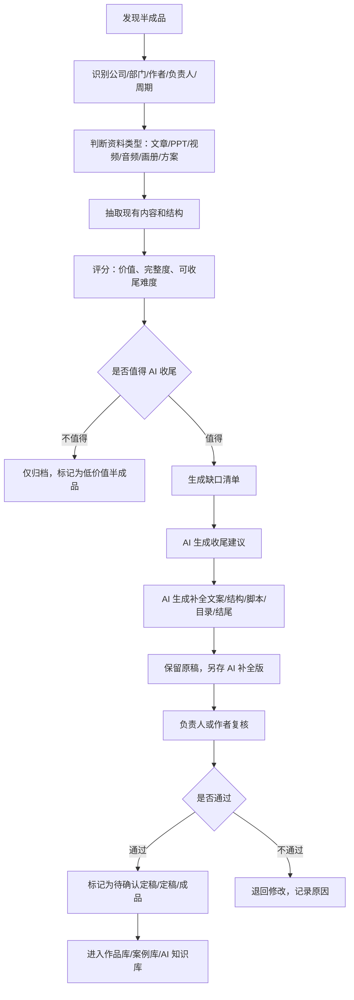

# 黑卫士 AI 数字档案管理系统 - 第三版半成品收尾与质量评分体系

版本：V3 草案  
定位：补充“优质半成品、未完工作品、录音转写、视频存档、作者归属、部门归属、评分标准、AI 辅助收尾、相似内容归类”的管理规则。

## 一、核心原则

公司 26 年历史数据里，不能只重视已经交付的成品。很多真正有价值的资料，可能是：

- 差一点点就能完成的文章、方案、PPT、画册、视频、活动策划
- 当年没有收尾，但创意很好、方向很好、素材很完整的半成品
- 老员工、老作者留下来的草稿、提纲、录音、会议纪要
- 同一作者或同一部门持续积累出来的风格作品
- 同一个项目中散落在不同硬盘里的素材、草稿、版本、定稿、交付件

所以系统要建立一个“半成品收尾机制”：先识别价值，再判断缺什么，然后由 AI 辅助完善，最后由负责人确认，给它画一个句号。

## 二、必须保留的归属字段

每一条档案，无论是成品、半成品、录音、视频、文章、PPT、图片，都必须尽量补齐这些字段。

| 字段 | 是否必须 | 示例 | 说明 |
|---|---|---|---|
| 公司 | 必须 | 广告公司、移民公司、传媒公司 | 归属到公司主体 |
| 部门 | 必须 | 策划部、设计部、视频部、销售部 | 归属到业务部门 |
| 作者 | 必须 | 张三 | 谁创作了主要内容 |
| 负责人 | 必须 | 李四 | 谁对项目或档案负责 |
| 参与人 | 建议 | 王五、赵六 | 协作者、执行人员 |
| 客户/项目 | 建议 | 某汽车品牌发布会 | 归属到项目或客户 |
| 周期 | 必须 | 2016-03 到 2016-06 | 开始时间、结束时间、持续周期 |
| 当前状态 | 必须 | 草稿、半成品、迭代版、定稿、成品 | 判断处理方式 |
| 完成度 | 必须 | 70% | 用于判断是否值得收尾 |
| 缺口说明 | 必须 | 缺结尾、缺排版、缺数据、缺配图 | AI 收尾依据 |
| 评分 | 必须 | 82 分 | 统一质量评估 |
| AI 处理状态 | 必须 | 未处理、可辅助、已补全、待人工确认 | 防止 AI 改完没人认领 |
| 最终确认人 | 必须 | 部门负责人/创始人 | 最终画句号的人 |
| AI 使用权限 | 必须 | 可训练、需脱敏、禁止训练 | 防止敏感资料误用 |

## 三、作品状态细分

| 状态 | 定义 | 系统处理 |
|---|---|---|
| 原始素材 | 只有素材，没有结构 | 保留、打标签、关联项目 |
| 创意苗子 | 有一个好想法、标题、方向，但内容不完整 | 进入“待孵化池” |
| 初稿 | 已有基础内容，但逻辑和细节不足 | AI 可辅助润色和补结构 |
| 半成品 | 已完成 50% 到 90%，缺少收尾或包装 | 优先进入“AI 收尾池” |
| 高价值半成品 | 创意、结构、素材较好，差一点可成作品 | 重点人工复核 |
| 迭代版 | 多个版本中的一个 | 关联版本链，找最终版 |
| 待确认定稿 | AI 或人工已补完，等负责人确认 | 不直接作为成品发布 |
| 定稿 | 内部确认完成 | 进入正式档案 |
| 成品 | 已完成作品 | 可进入作品库 |
| 经典作品 | 能代表公司风格和水准 | 进入 AI 风格库 |
| 经典案例 | 有背景、过程、结果、复盘 | 进入案例库 |

## 四、半成品 AI 收尾流程



### 4.1 AI 可以帮忙收尾的内容

| 类型 | AI 收尾方式 | 注意事项 |
|---|---|---|
| 文章 | 补标题、补小标题、补结尾、改结构、统一语气 | 必须保留原作者和 AI 修改记录 |
| PPT | 补目录、补逻辑页、补总结页、统一标题风格 | 不直接覆盖原 PPT |
| 策划案 | 补执行流程、时间表、预算结构、风险预案 | 关键数据需人工确认 |
| 画册 | 补文案、补目录、补页码说明、生成版式建议 | 设计源文件人工确认 |
| 视频脚本 | 补分镜、旁白、片尾、字幕文案 | 不自动替代导演/剪辑判断 |
| 录音 | 转写、分段、提炼重点、生成纪要和文章 | 需标注说话人和转写准确率 |
| 会议纪要 | 整理议题、结论、待办、负责人、截止时间 | 敏感会议需权限控制 |
| 合同/法务文档 | 只做摘要、风险提示、缺项提醒 | 不自动生成最终法律意见 |

### 4.2 AI 收尾版本命名

```text
原文件：2016-ADV-策划部-某项目-方案-半成品-V2-L2-HWS000123.pptx
AI 补全版：2016-ADV-策划部-某项目-方案-AI补全待确认-V3-L2-HWS000123-AI01.pptx
人工确认版：2016-ADV-策划部-某项目-方案-定稿-V4-L2-HWS000123-FINAL.pptx
```

规则：

- 原稿永远不覆盖
- AI 补全版必须单独保存
- 人工确认后才能变成定稿
- 所有 AI 改动要记录提示词、模型、时间、操作人

## 五、统一评分标准

评分总分 100 分，用于判断资料价值、收尾优先级和是否进入 AI 知识库。

| 评分项 | 分值 | 说明 |
|---|---:|---|
| 内容价值 | 20 | 是否有业务价值、历史价值、复用价值 |
| 完整度 | 15 | 是否接近完成，缺口是否清楚 |
| 创意/风格 | 15 | 是否体现公司风格、作者特色、创意水平 |
| 结构清晰度 | 10 | 目录、逻辑、段落、层次是否清楚 |
| 可复用性 | 10 | 是否可作为模板、案例、素材再次使用 |
| 证据链完整度 | 10 | 是否有关联合同、报价、素材、交付、结果 |
| 作者和归属清晰度 | 10 | 作者、部门、公司、负责人、周期是否明确 |
| AI 可处理度 | 5 | 是否适合 AI 补全、摘要、转写、标签 |
| 风险和敏感度控制 | 5 | 是否能脱敏，是否存在隐私、财务、合同风险 |

### 5.1 评分等级

| 分数 | 等级 | 处理建议 |
|---:|---|---|
| 90 到 100 | S 级 | 经典作品/经典案例候选，优先入 AI 知识库 |
| 80 到 89 | A 级 | 高价值资料，优先收尾和整理 |
| 70 到 79 | B 级 | 有复用价值，按批次整理 |
| 60 到 69 | C 级 | 普通留档，必要时摘要 |
| 60 以下 | D 级 | 低价值或残缺资料，仅索引留存 |

## 六、文章类资料结构统计

文章、新闻稿、公众号稿、软文、策划说明、报告类文档，都要自动统计结构指标。

| 指标 | 示例 | 用途 |
|---|---|---|
| 总字数 | 3200 字 | 判断内容体量 |
| 总段落数 | 28 段 | 判断可读性 |
| 一级标题数 | 5 个 | 判断结构 |
| 二级标题数 | 12 个 | 判断层次 |
| 标题列表 | 一、背景；二、策略；三、执行 | 生成目录 |
| 平均段落长度 | 114 字 | 判断是否太散或太长 |
| 摘要 | 200 字摘要 | 快速预览 |
| 关键词 | 移民、签证、品牌、公关 | 检索标签 |
| 主题分类 | 品牌策划/新闻稿/案例复盘 | 自动归类 |
| 情绪/语气 | 正式、热情、专业、故事化 | 学习作者风格 |
| 作者风格特征 | 喜欢长标题、排比句、案例开头 | 建立作者画像 |
| 缺口判断 | 缺结尾、缺案例、缺数据、缺小标题 | AI 收尾依据 |

### 6.1 文章评分补充

| 文章指标 | 好的标准 |
|---|---|
| 字数 | 与类型匹配，不是越长越好 |
| 标题 | 主标题清楚，有吸引力，有信息量 |
| 段落 | 段落不要过长，节奏清楚 |
| 小标题 | 能让人快速扫读 |
| 开头 | 交代背景、问题或冲突 |
| 中段 | 有事实、案例、观点、数据 |
| 结尾 | 有总结、行动建议或情绪落点 |
| 风格 | 与公司品牌和作者习惯一致 |

## 七、录音转写和音频归档

录音不能只当作音频文件保存，必须转成文字，才能进入检索和 AI 知识库。

| 字段 | 示例 | 说明 |
|---|---|---|
| 音频标题 | 2018 年某客户会议录音 | 标准标题 |
| 录音时间 | 2018-05-21 14:00 | 业务发生时间 |
| 录音地点 | 公司会议室/客户办公室 | 可选 |
| 参与人 | 张三、客户王总 | 说话人 |
| 公司/部门 | 公关公司/项目部 | 归属 |
| 负责人 | 李四 | 负责整理和确认 |
| 音频时长 | 01:23:45 | 播放和处理依据 |
| 转写文本 | 完整文字稿 | 全文检索 |
| 说话人分离 | 说话人 A/B/C | 会议复盘 |
| 摘要 | 会议主要讨论三件事 | 快速预览 |
| 待办事项 | 谁在什么时候做什么 | 转项目管理 |
| 转写准确率 | 85% | 判断是否需要人工校对 |
| 敏感等级 | L2/L3 | 权限控制 |

### 7.1 录音处理流程


## 八、视频和影视资料存档

视频既要保留原始高清文件，也要生成方便快速播放的预览版。

| 字段 | 示例 | 说明 |
|---|---|---|
| 视频标题 | 某活动宣传片成片 | 标准标题 |
| 视频类型 | 原始素材/剪辑工程/成片/花絮/发布版 | 状态分类 |
| 公司/部门 | 传媒公司/视频部 | 归属 |
| 作者/导演/剪辑 | 张三 | 创作归属 |
| 负责人 | 李四 | 项目责任 |
| 拍摄周期 | 2019-04 到 2019-05 | 周期 |
| 时长 | 03:20 | 检索和播放 |
| 分辨率 | 1920x1080/4K | 技术信息 |
| 字幕/转写 | 有/无 | 可检索 |
| 封面图 | 自动抽帧 | 快速预览 |
| 时间轴标签 | 00:30 嘉宾讲话，01:20 舞台 | 精确定位 |
| 关联文件 | 脚本、合同、报价、照片、PPT | 项目全貌 |

## 九、相似内容和同源归类

系统要自动把相似资料归在一起，避免同一个项目散落在不同硬盘里。

### 9.1 归类维度

| 归类方式 | 例子 | 用途 |
|---|---|---|
| 同一作者 | 张三写过的所有文章、方案、脚本 | 建立作者风格库 |
| 同一部门 | 策划部所有提案、视频部所有成片 | 建立部门知识库 |
| 同一公司 | 广告公司所有案例、移民公司所有客户方案 | 建立公司历史库 |
| 同一客户 | 某客户历年合同、方案、交付、反馈 | 建立客户档案 |
| 同一项目 | 素材、方案、报价、合同、成品、复盘 | 还原完整项目链 |
| 同一格式 | 所有 PPT、所有视频、所有录音 | 格式化处理和批量转码 |
| 同一主题 | 汽车、签证、体育赛事、孵化器招商 | 主题知识库 |
| 相似风格 | 风格接近的文案、画册、视频 | AI 风格学习 |
| 相似内容 | 文件名不同但内容接近 | 去重和版本识别 |

### 9.2 相似归类规则

| 判断依据 | 系统方法 |
|---|---|
| 文件名相似 | 文件名分词、客户名、项目名、年份匹配 |
| 内容相似 | 正文相似度、段落重复度、关键词重合 |
| 视觉相似 | 图片向量、版式、颜色、LOGO、人物场景 |
| 音频相似 | 转写文本相似、说话人、会议主题 |
| 视频相似 | 抽帧相似、字幕相似、时长和封面相似 |
| 版本关系 | V1/V2/终稿/最终/修改版/定稿等命名识别 |
| 项目关系 | 同一客户、同一时间、同一负责人、同一目录 |

## 十、作者和部门知识沉淀

系统应该能回答这些问题：

- 某个作者 10 年来写过哪些文章、方案、标题、脚本？
- 某个设计师做过哪些画册、海报、VI、版式？
- 某个部门最擅长什么类型的项目？
- 哪些作品最能代表某个作者、某个部门、某家公司？
- 同一个作者早期、中期、后期风格有什么变化？

### 10.1 作者画像字段

| 字段 | 示例 |
|---|---|
| 作者姓名 | 张三 |
| 所属公司 | 广告公司 |
| 所属部门 | 策划部 |
| 活跃周期 | 2012 到 2018 |
| 代表作品 | 某品牌提案、某活动策划 |
| 常见类型 | PPT、文章、活动方案 |
| 风格关键词 | 情绪强、标题感好、案例多 |
| 平均评分 | 84 分 |
| 经典作品数 | 12 |
| AI 可学习作品数 | 8 |

## 十一、待收尾作品池

建议系统单独设一个“待收尾作品池”，不要让好东西沉下去。

| 队列 | 进入条件 | 处理方式 |
|---|---|---|
| S 级待收尾 | 评分 90 分以上，完成度 60% 以上 | 优先安排 AI 和人工收尾 |
| A 级待收尾 | 评分 80 到 89，完成度 50% 以上 | 分批收尾 |
| 作者待确认 | 作者明确，但状态不明 | 找作者或负责人确认 |
| 负责人待确认 | 项目归属明确，负责人缺失 | 由部门负责人指定 |
| AI 可补全 | 缺口明确，敏感度可控 | 进入 AI 辅助流程 |
| 仅留档 | 缺口太大或敏感度高 | 不收尾，只做索引 |

## 十二、检索结果展示补充

搜索结果里不要只显示文件名，要显示“这个资料是谁做的、属于哪里、值不值得看”。

| 展示项 | 示例 |
|---|---|
| 标题 | 某汽车品牌发布会策划案 |
| 公司 | 广告公司 |
| 部门 | 策划部 |
| 作者 | 张三 |
| 负责人 | 李四 |
| 周期 | 2016-03 到 2016-06 |
| 状态 | 高价值半成品 |
| 完成度 | 85% |
| 评分 | A 级 86 分 |
| 缺口 | 缺预算页、缺结尾总结 |
| AI 建议 | 可补预算结构、总结页、执行时间表 |
| 关联资料 | 合同、报价、视频、照片、复盘 |

## 十三、补充到主系统的功能菜单

| 一级菜单 | 二级功能 |
|---|---|
| 待收尾作品池 | 高价值半成品、AI 可补全、作者待确认、负责人待确认 |
| 作者中心 | 作者作品、作者风格、代表作品、活跃周期 |
| 部门知识库 | 部门作品、部门案例、部门模板、部门评分 |
| 质量评分中心 | 自动评分、人工评分、评分规则、评分报告 |
| 录音转写中心 | 待转写、已转写、待校对、会议纪要、待办事项 |
| 视频存档中心 | 原始素材、剪辑工程、成片、字幕、时间轴标签 |
| 相似归类中心 | 同项目归类、同作者归类、相似版本、疑似重复 |

## 十四、下一步落地建议

第一阶段先选 50 到 100 个样本文件做评分和收尾测试：

1. 选文章、PPT、录音、视频、画册、方案各一批
2. 补齐公司、部门、作者、负责人、周期
3. 自动统计文章字数、段落、标题
4. 对录音做转写和摘要
5. 对视频做封面、抽帧、字幕/转写
6. 自动评分，筛出 S 级和 A 级半成品
7. 让 AI 生成收尾建议
8. 由你或负责人确认哪些可以真正完善成作品

