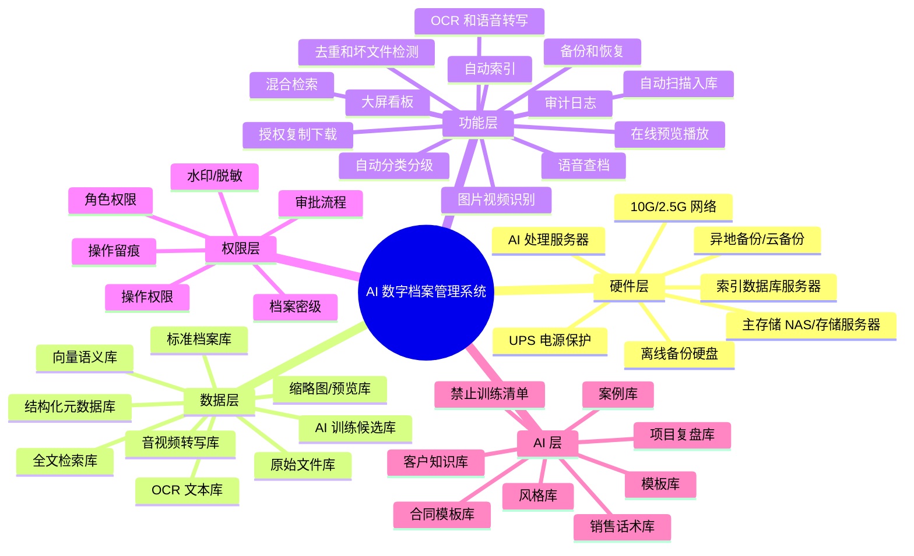
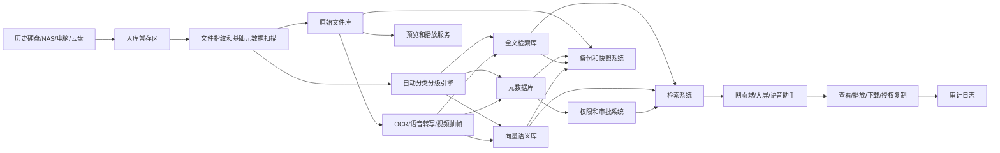
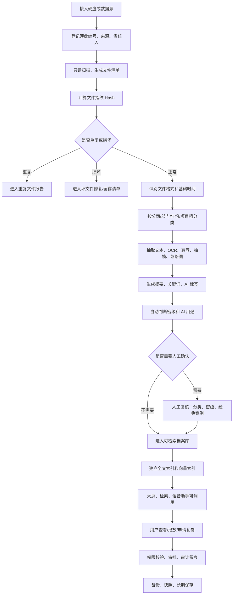
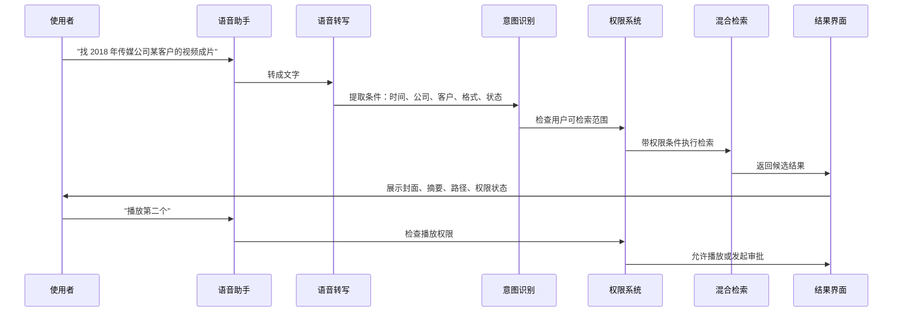
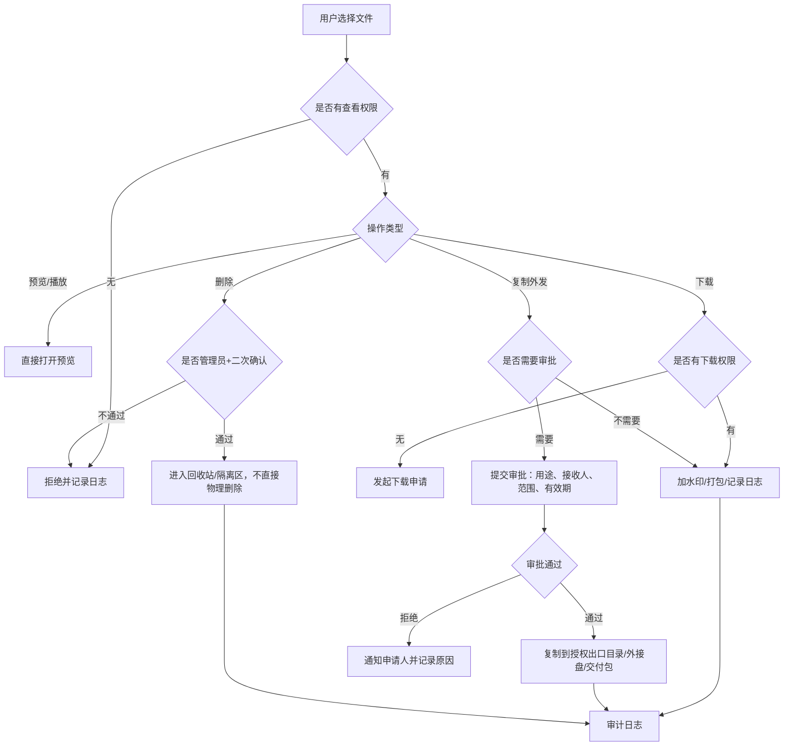
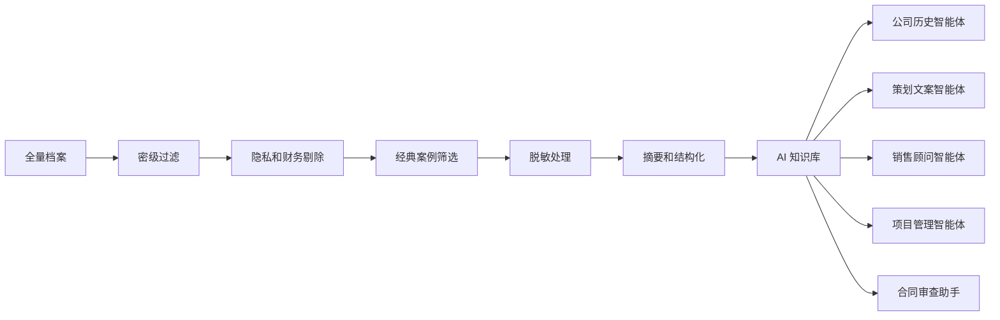

# 黑卫士 AI 数字档案管理系统 - 第二版系统蓝图与 SOP

版本：V2 草案  
定位：在第一版“分类、分级、检索框架”基础上，扩展为可落地的硬件方案、系统功能蓝图、自动索引流程、权限控制、备份方案、大屏交互和 AI 语音检索设计。

## 一、建设目标

这套系统不是普通网盘，也不是简单文件夹。它应该是公司 26 年历史数据的“数字档案馆 + 智能检索系统 + AI 案例知识库 + 大屏交互中心”。

核心目标：

- 把 40T 到 60T 以上历史硬盘数据先安全盘点，不乱动原文件
- 自动建立目录、索引、缩略图、转写文本、OCR 文本和 AI 标签
- 支持按公司、部门、年份、人员、项目、客户、格式、密级、作品状态检索
- 支持语音查找文件，例如“找 2016 年广告公司汽车客户的发布会视频”
- 支持照片、音频、音乐、视频、影视资料在线预览和播放
- 支持录音、视频自动转文字，形成可搜索内容
- 支持 Word、PPT、Excel、邮件、扫描件转换为可预览 PDF 或文本摘要
- 支持按权限查看、播放、下载、复制、修改、删除
- 支持申请授权后把文件复制到指定硬盘、U 盘、NAS 文件夹或外部交付包
- 支持大屏看板，用轻松、人性化的方式查看公司历史资产和系统运行状态
- 最终为公司自己的智能体提供经过筛选、脱敏、分级的案例库和风格库

## 二、参考原则

本方案借鉴成熟电子档案和 AI 文档处理系统的通用原则：

| 参考方向 | 借鉴要点 | 在本系统中的落地 |
|---|---|---|
| 电子档案生命周期 | 采集、维护使用、处置、移交、元数据、报表 | 入库、索引、权限、保留期限、导出、统计报表 |
| 元数据标准 | 标题、作者、日期、格式、主题、来源、权限等 | 建立统一档案字段和标签体系 |
| 长期保存元数据 | 对象、事件、权限、责任人 | 记录文件来源、处理历史、权限变化和操作人 |
| 智能文档处理 | OCR、分类、信息抽取、摘要、问答 | 对 PDF、扫描件、图片、表格、合同自动识别 |
| 混合检索 | 关键词检索 + 向量语义检索 | 既能精确找文件名，也能按意思找案例 |
| 存储安全 | 备份、隔离、不可篡改、恢复验证 | 防误删、防硬盘坏、防勒索病毒、防权限乱用 |

## 三、总体系统思维导图



## 四、推荐硬件架构

先按 60T 原始数据规模设计，预留未来扩展到 100T 到 200T 的空间。你刚才提到“几十个 G 的备份”，我这里按两类处理：第一类是原始档案，实际应按几十 T 备份；第二类是索引、缩略图、转写文本、数据库，可能是几十 G 到数 T。

### 4.1 硬件分层

| 层级 | 用途 | 推荐配置方向 | 说明 |
|---|---|---|---|
| 主存储层 | 保存原始文件和标准档案 | 8 盘位到 12 盘位 NAS 或存储服务器，企业级硬盘，RAID6/RAIDZ2 | 重点是稳定、可扩展、可快照 |
| AI 处理层 | OCR、语音转写、视频抽帧、图片识别、向量生成 | 高性能工作站或服务器，128G 内存起步，NVMe 缓存盘，可选 GPU | 后期 AI 处理很吃算力，建议和主存储分开 |
| 索引检索层 | 元数据库、全文检索、向量库 | 可与 AI 服务器合并，也可独立小服务器 | 保存“目录和索引”，不是保存全部原文件 |
| 预览缓存层 | 缩略图、PDF 预览、音视频转码缓存 | NVMe SSD 2T 到 8T | 决定大屏和检索响应速度 |
| 备份层 | 本地备份、离线备份、异地备份 | 第二台 NAS、移动硬盘柜、云对象存储、磁带库可选 | 不能只靠一台 NAS |
| 网络层 | 多人访问和大文件读取 | 10G 主干交换机，核心设备 10G，普通电脑 2.5G/1G | 视频和大文件预览需要 10G 更舒服 |
| 电力保护 | 防突然断电和文件系统损坏 | UPS，自动关机策略 | 档案系统必须配 UPS |

### 4.2 三档落地方案

| 方案 | 适合阶段 | 硬件组成 | 优点 | 风险 |
|---|---|---|---|---|
| A. 试点方案 | 先处理 1 到 2 块硬盘、几十 G 到几 T 资料 | 现有电脑 + 外置硬盘 + 小型数据库 | 成本低，先验证分类和检索体验 | 不能直接承载 60T 全量 |
| B. 推荐方案 | 公司内部正式使用 | 1 台主 NAS + 1 台 AI 工作站 + 10G 网络 + UPS + 离线备份盘 | 稳定、可扩展、性价比高 | 需要规范权限和备份 |
| C. 高可靠方案 | 核心数据长期保存 | 主 NAS + 备 NAS + AI 服务器 + 异地备份 + 不可篡改快照 | 防误删、防故障、防勒索能力强 | 成本高，需要运维 |

### 4.3 推荐容量规划

| 数据类型 | 初始估算 | 3 年预留 | 存储建议 |
|---|---:|---:|---|
| 原始文件 | 60T | 100T 到 150T | 主 NAS 大容量盘 |
| 标准整理库 | 10T 到 30T | 30T 到 60T | 可与原始库同盘池，不同目录 |
| 预览缩略图 | 500G 到 3T | 3T 到 8T | SSD 缓存 |
| OCR/转写文本 | 100G 到 2T | 2T 到 5T | 数据库 + 对象存储 |
| 全文索引 | 100G 到 1T | 1T 到 3T | SSD |
| 向量索引 | 100G 到 2T | 2T 到 6T | SSD，便于快速检索 |
| 本地备份 | 至少 60T | 至少与主数据相当 | 第二套盘或备 NAS |
| 离线/异地备份 | 重点数据优先 | 分批扩容 | 离线硬盘、异地 NAS 或云 |

## 五、系统逻辑架构图



## 六、数据运行 SOP 总流程



## 七、自动索引流程

自动索引要分三层：文件级索引、内容级索引、AI 语义索引。

| 层级 | 索引内容 | 作用 |
|---|---|---|
| 文件级索引 | 文件名、路径、大小、格式、创建时间、修改时间、硬盘编号、Hash | 快速盘点、去重、定位原文件 |
| 内容级索引 | OCR 文本、Word/PPT/PDF 正文、表格字段、邮件正文、音视频转写文本 | 支持全文搜索 |
| AI 语义索引 | 摘要、关键词、人物、客户、场景、项目、向量 Embedding | 支持“按意思找资料” |

### 7.1 自动索引规则

| 文件类型 | 自动处理 | 生成结果 |
|---|---|---|
| Word/PDF/TXT/Markdown | 提取正文、识别标题、摘要、关键词 | 全文索引、摘要、标签 |
| PPT/Keynote | 提取每页标题、备注、图片、转 PDF 预览 | PPT 内容索引、预览图 |
| Excel/CSV | 提取表头、表名、样例行、统计字段 | 表格索引、数据字典 |
| 图片/照片 | EXIF、OCR、人物/场景/物体识别、缩略图 | 图片标签、可视化预览 |
| 音频/录音/音乐 | 语音转写、说话人分离、音乐元数据、波形预览 | 转写文本、摘要、可播放 |
| 视频/影视 | 抽帧、字幕识别、语音转写、场景切片、封面 | 视频摘要、时间轴检索 |
| 邮件 | 发件人、收件人、主题、时间、附件、正文 | 邮件会话索引 |
| 程序/代码 | 项目识别、语言识别、README、依赖、版本 | 代码资产索引 |
| 压缩包 | 登记原包、解压沙箱扫描、记录内部目录 | 压缩包目录索引 |
| 财务账套/业务系统数据 | 只读登记、导出报表、权限隔离 | 受控索引，不直接训练 |

### 7.2 响应速度设计

| 场景 | 目标体验 | 设计办法 |
|---|---|---|
| 输入关键词搜索 | 1 到 3 秒出结果 | 元数据和全文索引放 SSD |
| 语音查找 | 3 到 8 秒给候选结果 | 语音转文字后走混合检索 |
| 图片列表浏览 | 秒开缩略图 | 预生成缩略图，不临时读取原图 |
| 视频预览 | 点开快速播放 | 预生成低码率预览版和封面 |
| 大文件下载 | 审批后后台打包 | 不阻塞检索界面 |
| AI 问答 | 先给摘要，再展开证据 | 只取有权限的片段进入 AI |

## 八、目录设计

多维分类不能完全靠文件夹解决，否则同一个文件会被复制很多份。建议“物理目录稳定 + 元数据标签灵活”。

### 8.1 物理目录

```text
/ArchiveVault
  /00_System
    /IndexDatabase
    /SearchIndex
    /VectorIndex
    /Logs
    /Reports
  /01_Inbox_待入库
    /Disk_硬盘编号
    /Cloud_云盘导入
    /Manual_人工上传
  /02_Original_原始封存
    /CompanyCode_公司编号
      /Year_年份
        /SourceDisk_来源硬盘
  /03_Managed_标准档案库
    /CompanyCode_公司编号
      /Year_年份
        /ProjectCode_项目编号
          /01_合同
          /02_方案
          /03_素材
          /04_成品
          /05_复盘
  /04_Derivatives_衍生文件
    /Thumbnails_缩略图
    /PreviewPDF_PDF预览
    /Transcripts_转写文本
    /OCR_OCR文本
    /VideoProxy_视频预览版
  /05_AI_Knowledge_AI知识库
    /Public_L0
    /Internal_L1
    /Desensitized_L2
    /CaseLibrary_案例库
    /StyleLibrary_风格库
    /Forbidden_禁止训练清单
  /06_Export_授权导出
    /Pending_待审批
    /Approved_已批准
    /Delivered_已交付
  /07_Backup_备份清单
    /BackupReports
    /RestoreTests
```

### 8.2 文件命名规则

```text
年份-公司编号-部门-客户或项目-资料类型-状态-版本-密级-原始编号.扩展名
```

示例：

```text
2016-ADV-策划部-某汽车品牌发布会-提案-定稿-V3-L2-HWS000123.pptx
2018-MEDIA-视频部-某栏目-成片-公开发布版-V1-L0-HWS000456.mp4
2020-IMM-顾问部-某客户签证-申请材料-封存-V1-L3-HWS000789.pdf
```

说明：原始文件名必须保留在元数据里。整理后的标准名用于检索和管理，但不要破坏原始证据链。

## 九、功能菜单设计

### 9.1 一级菜单

| 一级菜单 | 用途 |
|---|---|
| 大屏首页 | 看公司数字资产总览、容量、今日索引、经典案例、备份状态 |
| 智能检索 | 关键词、语义、语音、筛选、多条件组合查找 |
| 资料入库 | 硬盘导入、云盘导入、人工上传、扫描任务管理 |
| 档案目录 | 按公司、部门、年份、项目、人员、格式浏览 |
| 媒体中心 | 图片、音频、音乐、视频、影视资料播放和管理 |
| 案例作品库 | 经典作品、经典案例、成品、半成品、迭代版本 |
| 待收尾作品池 | 高价值半成品、未完工作品、AI 补全建议、人工确认 |
| 作者中心 | 按作者查看文章、方案、设计、视频、录音和风格沉淀 |
| 质量评分中心 | 自动评分、人工评分、完成度、文章字数段落标题统计 |
| AI 知识库 | 可训练资料、需脱敏资料、禁止训练资料、智能体数据集 |
| 录音转写中心 | 录音转文字、说话人分离、摘要、会议纪要、待办事项 |
| 相似归类中心 | 同作者、同部门、同公司、同格式、同项目、相似内容归类 |
| 审批中心 | 下载、复制、外发、删除、密级变更审批 |
| 权限管理 | 用户、角色、部门、密级、操作权限 |
| 备份中心 | 备份任务、快照、离线备份、恢复演练 |
| 审计日志 | 谁查了、谁看了、谁下载了、谁删除了 |
| 系统设置 | 分类字典、标签字典、公司字典、部门字典、AI 参数 |

### 9.2 智能检索菜单

| 功能 | 子功能 | 说明 |
|---|---|---|
| 一句话检索 | 文本输入、语音输入 | 像聊天一样找档案 |
| 高级筛选 | 公司、部门、年份、作者、客户、格式、密级、状态 | 精准过滤 |
| 语义搜索 | 按意思找、按相似案例找 | 例如“找风格像某某发布会的方案” |
| 全文搜索 | 搜 PDF、Word、PPT、转写文字 | 查内容里的文字 |
| 媒体搜索 | 按人物、场景、地点、时长、格式找 | 图片视频音频专用 |
| 结果排序 | 相关度、时间、热度、价值等级、最近使用 | 快速定位 |
| 结果预览 | 摘要、缩略图、片段、高亮命中词 | 不打开大文件也能判断 |
| 保存检索 | 常用条件保存 | 例如“广告公司经典案例” |

### 9.3 资料入库菜单

| 功能 | 子功能 | 说明 |
|---|---|---|
| 硬盘登记 | 硬盘编号、容量、来源、负责人、状态 | 每块硬盘先登记 |
| 只读扫描 | 文件清单、Hash、格式、时间 | 不改动原文件 |
| 自动分类 | 公司、部门、年份、项目、格式 | 第一轮粗分类 |
| AI 识别 | OCR、转写、图片识别、摘要 | 生成可检索内容 |
| 人工复核 | 疑似分类、敏感资料、经典案例 | 人参与关键判断 |
| 入库发布 | 进入正式检索库 | 权限生效 |

### 9.4 媒体中心菜单

| 类型 | 支持能力 |
|---|---|
| 照片/图片 | 缩略图墙、放大预览、EXIF、OCR、人物/场景标签 |
| 音频/录音 | 在线播放、波形、转文字、说话人识别、重点片段 |
| 音乐 | 播放、歌名/作者/版权信息、用途标签 |
| 视频/影视 | 在线播放、封面、抽帧、字幕、转写、时间轴搜索 |
| 画册/设计稿 | PDF 预览、页码浏览、源文件关联 |
| PPT/Word/Excel | 转 PDF 预览、原文件受控下载 |

## 十、语音交互流程



### 10.1 语音命令示例

| 语音命令 | 系统动作 |
|---|---|
| “找 2016 年广告公司汽车客户的发布会方案” | 搜索 PPT、Word、PDF 和项目档案 |
| “播放这段会议录音” | 打开音频播放器 |
| “把这个录音转成文字” | 创建转写任务 |
| “找和这个案例风格类似的作品” | 走向量语义搜索 |
| “申请把这批文件复制给王总” | 进入复制审批流程 |
| “只看公开可训练的经典案例” | 筛选 L0、经典案例、AI 可训练 |
| “显示今天新增了多少文件” | 打开大屏统计 |

## 十一、授权复制和下载流程



### 11.1 操作权限矩阵

| 角色 | 搜索 | 查看元数据 | 预览/播放 | 下载 | 复制外发 | 修改标签 | 删除 | 管理权限 |
|---|---|---|---|---|---|---|---|---|
| 董事长/最高授权人 | 全部 | 全部 | 全部 | 全部 | 全部 | 可 | 可审批 | 全部 |
| 档案管理员 | 全部索引 | 全部 | 按授权 | 按授权 | 需审批 | 可 | 可发起 | 档案配置 |
| 部门负责人 | 本部门 | 本部门 | 本部门 | 需规则 | 需审批 | 可建议 | 不可 | 部门范围 |
| 项目负责人 | 项目范围 | 项目范围 | 项目范围 | 需规则 | 需审批 | 可建议 | 不可 | 项目范围 |
| 普通员工 | 授权范围 | 授权范围 | 授权范围 | 通常不可 | 需审批 | 不可 | 不可 | 无 |
| 财务角色 | 财务范围 | 财务范围 | 财务范围 | 需审批 | 需审批 | 可建议 | 不可 | 财务范围 |
| 人事角色 | 人事范围 | 人事范围 | 人事范围 | 需审批 | 需审批 | 可建议 | 不可 | 人事范围 |
| 外部临时用户 | 指定文件 | 指定文件 | 指定预览 | 通常不可 | 不可 | 不可 | 不可 | 无 |

### 11.2 密级权限矩阵

| 密级 | 查看 | 播放/预览 | 下载 | 复制 | 修改 | 删除 | AI 使用 |
|---|---|---|---|---|---|---|---|
| L0 公开 | 授权用户可看 | 可 | 可 | 可 | 管理员 | 管理员审批 | 可训练 |
| L1 内部 | 内部授权 | 可 | 视角色 | 需记录 | 管理员 | 管理员审批 | 可摘要/可内部训练 |
| L2 业务敏感 | 项目/部门授权 | 可 | 需审批 | 需审批 | 管理员 | 高级审批 | 脱敏后可用 |
| L3 隐私敏感 | 专人授权 | 受控 | 严格审批 | 严格审批 | 专人 | 最高审批 | 不直接训练 |
| L4 财务敏感 | 财务和最高授权 | 受控 | 严格审批 | 严格审批 | 财务授权 | 最高审批 | 禁止训练 |
| L5 核心机密 | 最高授权 | 受控 | 原则上禁止 | 原则上禁止 | 最高授权 | 最高授权 | 禁止训练 |

## 十二、大屏看板设计

大屏要轻松、人性化，不做复杂后台。它的任务是让你一眼看懂“公司数字资产现在怎么样”。

| 看板区域 | 展示内容 | 交互方式 |
|---|---|---|
| 总资产 | 文件总数、总容量、已索引容量、未处理容量 | 点击进入资产分布 |
| 公司分布 | 各公司资料量、年份分布、经典案例数 | 点击公司看目录 |
| 时间轴 | 26 年发展时间线、重要项目节点 | 滑动年份查看 |
| 媒体墙 | 最新照片、视频、画册、成片 | 点开播放 |
| 今日任务 | 正在 OCR、转写、抽帧、索引的任务 | 查看进度 |
| AI 知识库 | 可训练、需脱敏、禁止训练资料数量 | 进入数据集管理 |
| 风险提醒 | 备份失败、硬盘异常、重复文件、敏感外发 | 点击处理 |
| 经典作品 | 精选案例、代表作品、金牌模板 | 收藏和播放 |
| 检索热词 | 最近常查客户、项目、年份、业务 | 一键检索 |
| 备份状态 | 最近备份时间、快照、离线备份、恢复演练 | 查看报告 |

## 十三、备份和灾备方案

### 13.1 备份原则

建议按“主数据 + 本地备份 + 离线/异地备份 + 快照 + 恢复演练”做。只买一台大 NAS 不叫备份，因为误删、勒索病毒、火灾、进水、硬件故障都会影响同一套设备。

| 备份对象 | 频率 | 保存位置 | 说明 |
|---|---|---|---|
| 元数据库 | 每天多次 | 主机 SSD + NAS + 异地 | 这是目录和标签，优先级极高 |
| 搜索索引 | 每天 | NAS + 可重建备份 | 索引可重建，但重建很耗时 |
| 原始文件 | 每周增量、每月全量 | 备 NAS/离线硬盘/异地 | 原始文件最重要 |
| 预览和缩略图 | 每周 | NAS | 可重建，但影响体验 |
| OCR/转写文本 | 每天 | NAS + 异地 | 生成成本高，建议备份 |
| 系统配置 | 每次变更后 | NAS + 异地 | 包括权限、字典、审批规则 |
| 审计日志 | 每天 | 只增不改存储 | 不能被普通管理员随意删除 |

### 13.2 备份分层

| 层级 | 做法 | 目的 |
|---|---|---|
| 快照 | 主 NAS 每小时/每天快照 | 快速恢复误删和误改 |
| 本地备份 | 第二台 NAS 或本地备份盘 | 主设备坏了还能恢复 |
| 离线备份 | 定期接入硬盘备份后断开 | 防勒索病毒和误操作 |
| 异地备份 | 放在另一办公室或可靠云存储 | 防火灾、进水、盗窃 |
| 不可篡改备份 | 对核心数据启用对象锁/只读快照 | 防恶意删除和勒索 |
| 恢复演练 | 每月抽样恢复、每季度完整演练 | 证明备份真的能用 |

### 13.3 RPO/RTO 建议

| 数据类型 | RPO 能接受丢多久 | RTO 多久恢复可用 | 建议 |
|---|---|---|---|
| 元数据库/权限 | 1 小时内 | 2 小时内 | 高频备份 |
| 原始档案 | 1 天内 | 1 到 3 天 | 增量备份 + 快照 |
| 搜索索引 | 1 天内 | 1 到 2 天 | 可重建但要备份 |
| 大屏和系统配置 | 1 天内 | 半天 | 配置版本化 |
| AI 知识库 | 1 天内 | 1 天 | 数据集和向量都备份 |

## 十四、AI 知识库和训练规则

AI 不能直接吃全部 60T 数据。正确做法是先分类、分级、脱敏、筛选，再让智能体读取。



| 资料类型 | AI 处理建议 |
|---|---|
| 公开作品、公开文章、公开视频 | 可进入训练和检索 |
| 经典案例复盘 | 优先进入案例库 |
| 提案、PPT、文案、画册 | 可进入风格库，敏感客户需脱敏 |
| 合同模板 | 可进入模板库，真实合同需脱敏 |
| 客户隐私、证件、签证、移民材料 | 不直接训练，只做受控检索 |
| 财务账套、工资、银行流水、税务 | 禁止训练 |
| 源代码和核心数据 | 默认禁止训练，单独授权 |
| 失败案例 | 可内部学习，不公开展示 |

## 十五、推荐技术组成

这里先写“技术方向”，不锁定具体品牌，后面采购时再按预算选型。

| 模块 | 技术方向 | 说明 |
|---|---|---|
| 主存储 | NAS、ZFS/RAID、快照、SMB/NFS | 保存原始档案 |
| 对象存储 | S3 兼容对象存储 | 保存预览、转写、缩略图、导出包 |
| 元数据库 | PostgreSQL/MySQL | 保存档案字段、权限、审批、日志 |
| 全文检索 | OpenSearch/Elasticsearch/类似搜索引擎 | 搜文件名和正文 |
| 向量检索 | pgvector/Qdrant/Milvus/类似向量库 | 做语义搜索和相似案例 |
| OCR | 本地 OCR + 云 OCR 可选 | 扫描件、图片、PDF 识别 |
| 语音转写 | 本地或云端 ASR | 录音、会议、视频转文字 |
| 视频处理 | FFmpeg + 任务队列 | 抽帧、转码、封面、字幕 |
| 任务队列 | Redis/RabbitMQ/类似队列 | 批量索引不堵界面 |
| 权限认证 | 账号密码、企业微信/LDAP/SSO 可选 | 统一身份 |
| 前端 | Web 大屏 + 管理后台 + 移动端适配 | 轻松交互 |
| 审计 | 不可随意修改的日志表 | 操作留痕 |

## 十六、首期实施路线

| 阶段 | 时间 | 目标 | 产出 |
|---|---|---|---|
| 0. 试点准备 | 1 周 | 确认分类、密级、权限、硬件预算 | V3 需求确认稿 |
| 1. 小样本试点 | 1 到 2 周 | 接入 1 块硬盘或 500G 到 2T 样本 | 文件清单、索引报告、检索 Demo |
| 2. 核心系统搭建 | 2 到 4 周 | 搭建 NAS、数据库、检索、权限、预览 | 可用内测版 |
| 3. AI 处理流水线 | 2 到 4 周 | OCR、转写、摘要、标签、向量检索 | AI 检索版 |
| 4. 大屏和语音交互 | 2 周 | 大屏看板、语音查询、播放体验 | 展示版 |
| 5. 全量数据治理 | 持续 | 分批扫描 60T 历史数据 | 分批入库报告 |
| 6. AI 智能体接入 | 持续 | 建案例库、风格库、模板库 | 公司专属智能体 |

## 十七、需要你确认的第二批问题

| 问题 | 为什么要确认 |
|---|---|
| 现在大概有多少块硬盘？每块多大？ | 决定扫描和备份节奏 |
| 数据主要在移动硬盘、电脑、NAS、网盘，还是混合？ | 决定接入方式 |
| 公司内部有多少人需要使用系统？ | 决定权限和并发 |
| 谁拥有最高授权？谁能批下载、复制、删除？ | 决定审批流程 |
| 哪些公司/年份/项目最优先整理？ | 先做高价值资料 |
| 你希望先做大屏展示，还是先做检索实用？ | 决定第一期重点 |
| 是否允许使用云端 OCR/语音转写？ | 关系到隐私、成本和速度 |
| 经典作品和经典案例谁来最终认定？ | AI 风格库需要人工把关 |
| 预算偏向节省、均衡，还是一次搭好？ | 决定硬件档位 |

## 十八、下一步建议

建议下一步不要直接动全部 60T，而是先拿一块代表性硬盘做试点：

1. 登记硬盘和目录结构
2. 只读扫描生成文件清单
3. 统计文件类型、容量、年份、重复情况
4. 自动抽取一小批文档、图片、音频、视频做 OCR 和转写
5. 做一个小型检索 Demo
6. 让你用语音和大屏体验“找资料、看资料、听资料、播资料”
7. 根据体验再定全量系统

这样最稳：先看到效果，再扩大投入。

## 十九、参考资料

- NARA Universal Electronic Records Management Requirements：电子档案管理生命周期包括采集、维护使用、处置、移交、元数据、报表。
- Dublin Core Metadata Element Set：提供标题、作者、日期、格式、主题、权限等通用资源描述字段。
- PREMIS Data Dictionary：数字保存元数据包括对象、事件、权限、责任人。
- Azure AI Search Hybrid Search：混合检索把全文关键词和向量语义检索结合，提升相关性。
- AWS Accelerated Intelligent Document Processing：智能文档处理可结合 OCR、分类、信息抽取、摘要、问答和实时任务看板。
- NIST SP 800-209 Security Guidelines for Storage Infrastructure：存储系统应考虑数据保护、隔离、恢复验证、加密、不可篡改和异地保存。
